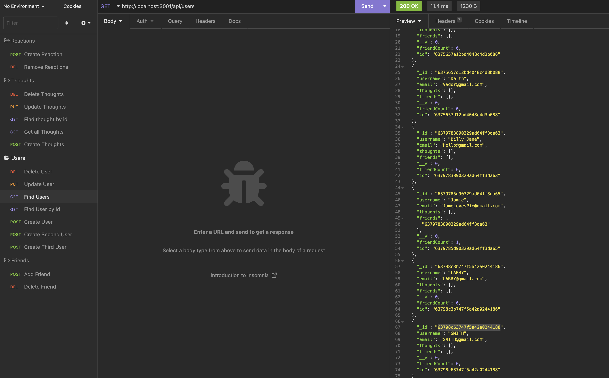
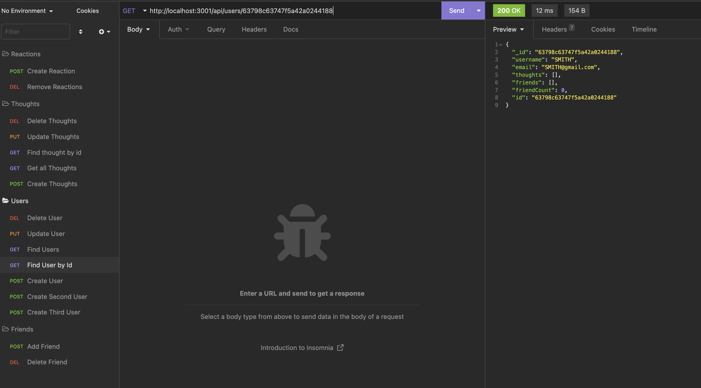
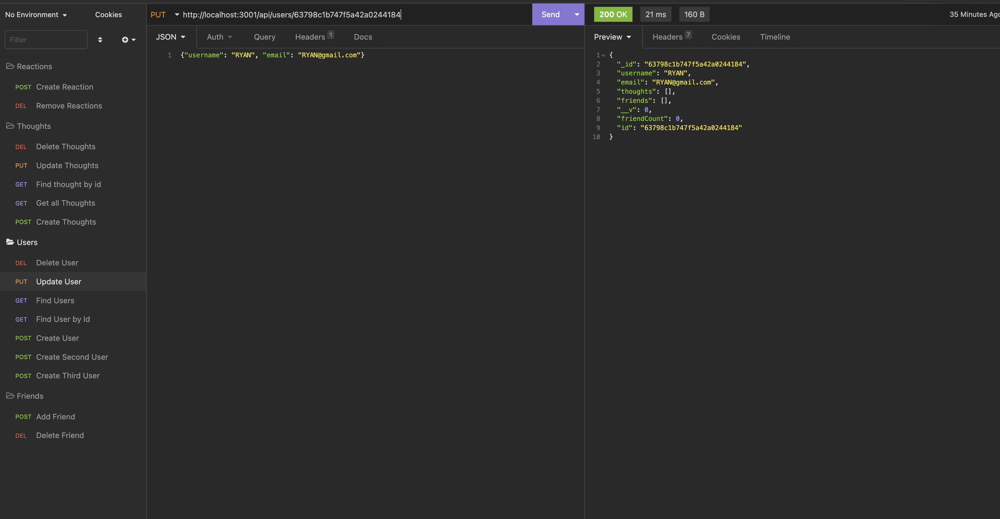
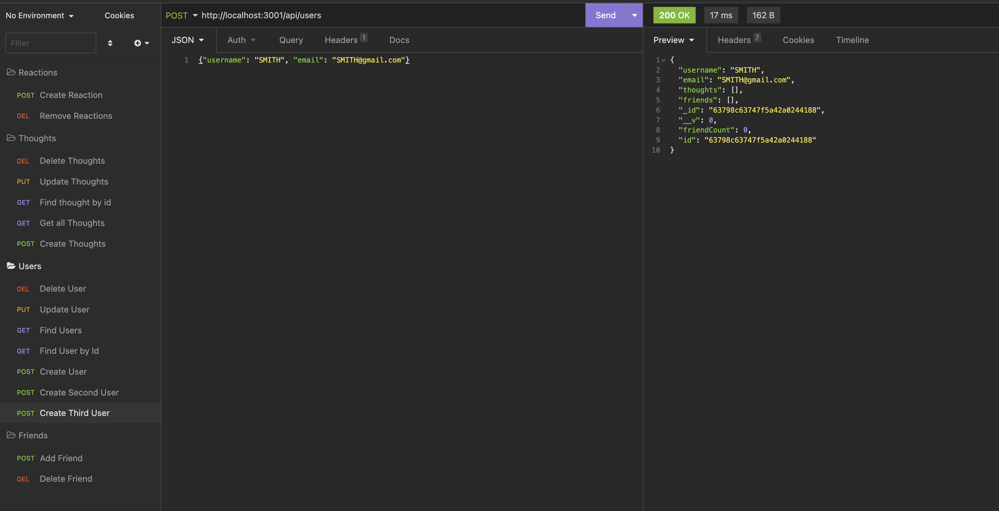
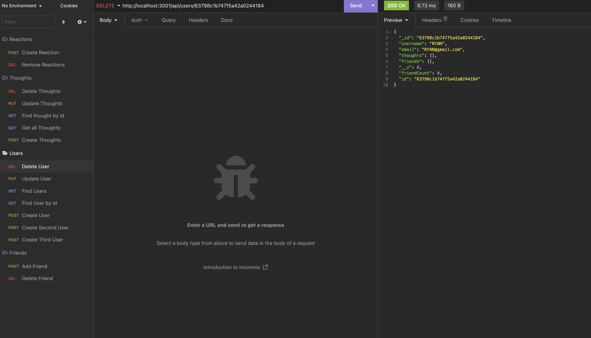
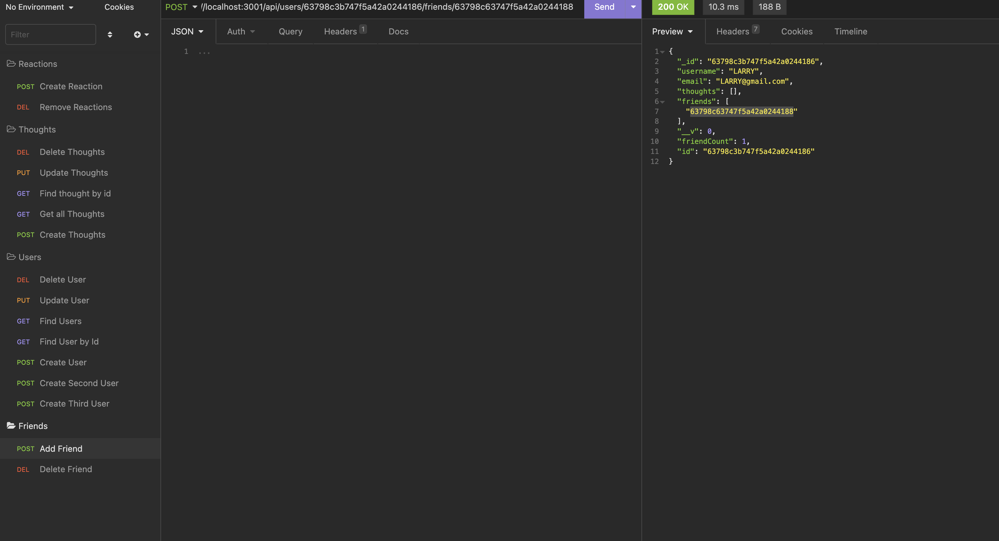

https://watch.screencastify.com/v/pAktvWQ6itVc7JqYAh01

# *** SOCIAL-NETWORK-API ***

## **Description** 📚

*SOCIAL-NETWORK-API * is a NoSQL api which can be used for a social network as it has post, put, delete, and get routes for users, their thoughts, and reactions to these thoughts..

## **Table of Contents** 📄

* Installation
* Usage
* License
* Contributing
* Testing
* Technology
* Questions

---

## **Installation** ⚙️

To use this application clone down the repository: [GitHub Repository](https://github.com/scarfrae/Social-Network-API). NOTE: need mongodb installed

Then install these dependencies:
* mongoose
* express

To test application via routes:
* npm run start in terminal of application
* Go to insomnia and test routes

### **Usage** 💻
* NOTE: 200 is success message and 404 is error message 
* NOTE: There are just examples of the different insomnia testing of routes to view all routes visit walkthrough below.
* Can get Users or Thoughts

* Can get one User or one Thought

* Can update one User or Thought

* Can create User, Thought, Reaction

* Can delete User 

* Can add Friend 

To view video walkthrough visit:
https://watch.screencastify.com/v/pAktvWQ6itVc7JqYAh01

### **License** 💳

MIT License

Copyright © 2022

Permission is hereby granted, free of charge, to any person obtaining a copy of this software and associated documentation files (the "Software"), to deal in the Software without restriction, including without limitation the rights to use, copy, modify, merge, publish, distribute, sublicense, and/or sell copies of the Software, and to permit persons to whom the Software is furnished to do so, subject to the following conditions:

The above copyright notice and this permission notice shall be included in all copies or substantial portions of the Software.

THE SOFTWARE IS PROVIDED "AS IS", WITHOUT WARRANTY OF ANY KIND, EXPRESS OR IMPLIED, INCLUDING BUT NOT LIMITED TO THE WARRANTIES OF MERCHANTABILITY, FITNESS FOR A PARTICULAR PURPOSE AND NONINFRINGEMENT. IN NO EVENT SHALL THE AUTHORS OR COPYRIGHT HOLDERS BE LIABLE FOR ANY CLAIM, DAMAGES OR OTHER LIABILITY, WHETHER IN AN ACTION OF CONTRACT, TORT OR OTHERWISE, ARISING FROM, OUT OF OR IN CONNECTION WITH THE SOFTWARE OR THE USE OR OTHER DEALINGS IN THE SOFTWARE.

### **Testing** 📝
All testing was done by the developing team.

### **Technology** 💡
* Node.js
* Sequelize
* MySql2
* Express
* Dotenv
* Screencastify

### **Contact** ☎
* Sterling Cafrae **-** [Github](https://github.com/scarfrae)**,** [LinkedIn](https://www.linkedin.com/in/sterling-carfrae-a2a8151a5/)
...
***
